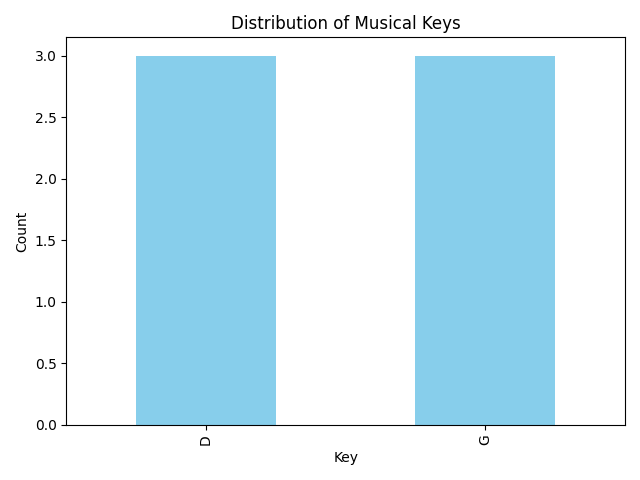

# Data Centric Programming Assignment 2025

Module: Data Centric Programming DATA2005

Course: TU850/2 – Data Science & AI

Lecturer: Bryan Duggan

Name: Prosper Umeh

Student Number: C24365571

# Screenshots

# Description of the project
This project uses real world data and applications to imulate a small library manager to rescan folders and populate the database, show statistcs, search titles, makes graphs and plot points and list tunes by book within the ABC format.
# Instructions for use

Make sure to run the setup_data.py first(source venv/bin/activate)(python setup_data.py) in your terminal as thr program needs fake folders and sample tunes to have data in the database to anaylyze. Now we run the main program(python abc_parser_app.py) and when the menu base which gives you alot of amazing options to choose from f=like plots or book titles.

# How it works:

(setup_data):The Preparation and Initialization File
This file handles the necessary steps to prepare the environment and create the essential data infrastructure before the main application runs.

Creates Directory Structure: This script ensures the required abc_books/ folder and the numbered sub-folders (0, 1, 2, 3) exist on the file system, simulating the actual musical dataset.

Generates Sample Data: It creates and populates the sample .abc tune files (e.g., tune001.abc, tune100.abc) inside those folders, providing the raw text data that the main application will process.

Sets Up the Database: It connects to the SQLite file (tunes.db) and creates the empty tunes table if it doesn't already exist, establishing the structure needed to store the parsed music metadata.

(abc_parser_app.py) : The Execution and User Interface File
This is the main application file that contains the running logic, the menu, and the core classes (TuneAnalyzer, TuneDatabase) to process and analyze the music data.

Presents the Menu: It runs the main application loop, displaying the interactive Command-Line Interface (CLI) menu (Options 1 through 6) to the user.

Handles Data Ingestion (Option 1): When the user selects Option 1 ("Re-scan folders"), the code:

Recursively traverses the file structure created by setup_data.py.

Parses the raw text from the .abc files, extracts metadata (Title, Key, Rhythm), and transforms it into structured records.

Inserts these new records into the tunes.db database.

Performs Data Analysis (Options 2, 3, 4): It contains the TuneAnalyzer class which uses Pandas to:

Load all tunes from the database into a DataFrame (df).

Process user input for searching and filtering (e.g., searching by title or filtering by book ID).

Generates Visualizations (Option 5): It executes the plot_key_distribution function, which uses Matplotlib to statistically summarize the data and display a chart to the user.

Manages Application Flow: It takes user input, calls the appropriate function, and ensures the program returns gracefully to the main menu or exits cleanly.

# List of files in the project

| Files | Source |
|-----------|-----------|
| abc_parser_app.py | Self written |
| setup_data.py | Self Written |
| .gitignore   | ignore  |
# References

sqllite tutorial #1 hyperlink
Codecademy #4 hyperlink
Lab5 DCP (parsing)
parsing tutorial #5 hyperlink
Lab4
Lab 10

# What I am most proud of in the assignment

I am most proud of successfully integrating data analysis with visual presentation, specifically through the creation of the key distribution charts using Matplotlib. I was the most difficult having to bridge the gap between pandas and matplotlib, and that why I truly believe it was the most impressive, especially as I tried to run it the first time and there were major problems in my code and i was luckily able to find them in time.
    
    def __init__(self, db_name: str = "tunes.db"):
        self.conn = sqlite3.connect(db_name)

    def load_data(self) -> pd.DataFrame:
        """Loads entire SQL table into a DataFrame."""
        query = "SELECT * FROM tunes"
        return pd.read_sql(query, self.conn)
    
    def get_tunes_by_book(self, df: pd.DataFrame, book_id: int) -> pd.DataFrame:
        """Filter dataframe by book ID."""
        return df[df['book_id'] == book_id]
    
    def get_tunes_by_rhythm(self, df: pd.DataFrame, rhythm: str) -> pd.DataFrame:
        """Filter dataframe by rhythm type."""
        # Case insensitive string contains
        return df[df['rhythm'].str.contains(rhythm, case=False, na=False)]
    
    def search_tunes(self, df: pd.DataFrame, search_term: str) -> pd.DataFrame:
        """Search titles for a specific term."""
        return df[df['title'].str.contains(search_term, case=False, na=False)]

    def plot_key_distribution(self, df: pd.DataFrame) -> None:
        """Optional: Visualise the keys used in the books."""
        if df.empty:
            print("No data to plot.")
            return

        counts = df['key_sig'].value_counts().head(10) # Show top 10
        counts.plot(kind='bar', color='skyblue')
        plt.title('Distribution of Musical Keys')
        plt.xlabel('Key')
        plt.ylabel('Count')
        plt.tight_layout()
        plt.show()

# What I learned

I learned how to seperate responsibilities into distinct files (setup_data.py for creation, abc_parser_app.py for execution), demonstrating good application and helping the actual content of the files be managable showing me how great managing stuff is especially in code. I earned to read unstructured text files (the ABC notation), extract specific pieces of information (T:, R:, K:), and transform that raw data into a structured format (a Python dictionary/SQL record). And I learned the importance of user interactions and visualisatins which was achieved with the use of matplotlib ( to convert maningful numbers into plots making it easier to understand) snd building a menu interface making it easier for the user.

#Challenges 

I've faced
Some challenges I faced along the way were the initial plot graphs as when I put option 5 it wasnt working to fix this though I found the problem though was in my code so i changed the the (counts = df['key_clean'].value_counts().head(10) # Show top 10
) Since your database table and DataFrame only contain a column named key_sig (which stores the key signature data like 'D' or 'G'), the 'key_clean' column doesn't exist, causing the error. The way I found out how to solve it was to change the column name on line 187 from 'key_clean' to the correct column name, 'key_sig'.

